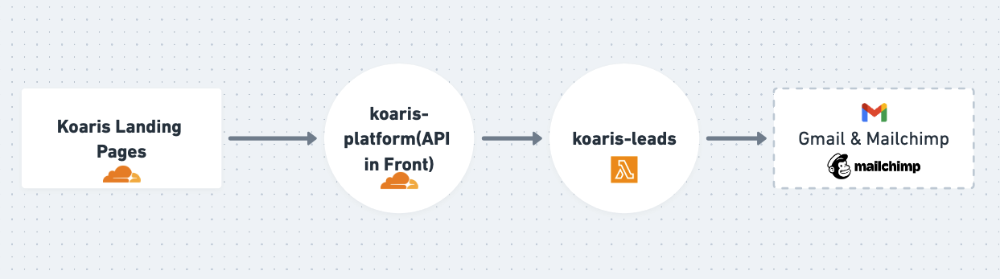

# Introduction
A Webhook application using AWS Lambda to forward contact leads requests to Google and Mailchimp!



## Test
Run the new server
```bash
serverless offline start --config serverless-local.yml
```
Run the new key
```bash
npm run key
```

## Deploy Commands
To deploy serverless
```bash
serverless deploy
```
To see serverless informations
```bash
serverless info
```
To undeploy
```bash
serverless remove
```
Send a Test Event
```bash
curl -X POST http://localhost:3001/dev/webhook \
     -H "x-webhook-signature: aaaaa" \
     -H "Content-Type: application/json" \
     -d '{"type": "touch", "optin": true, "user": {"FirstName": "Joe", "LastName": "Doe", "Phone": "11912345678", "Email": "joe.doe@test.com", "Source": "Koaris LP - Touchs"}}'
```

### Possible types
- type: touch - Check optin, if yes integrate with mailchimp
- type: lead - Just integrate with mailchimp